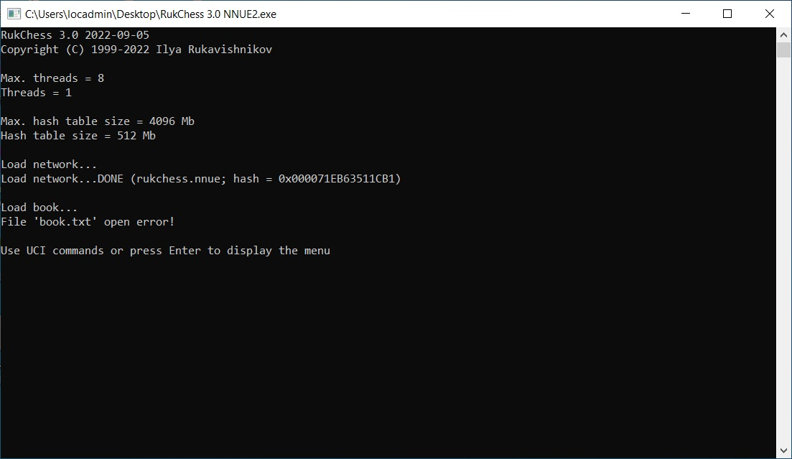
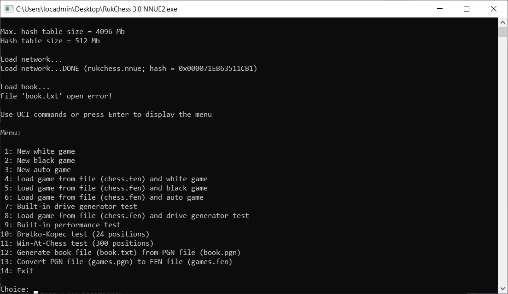
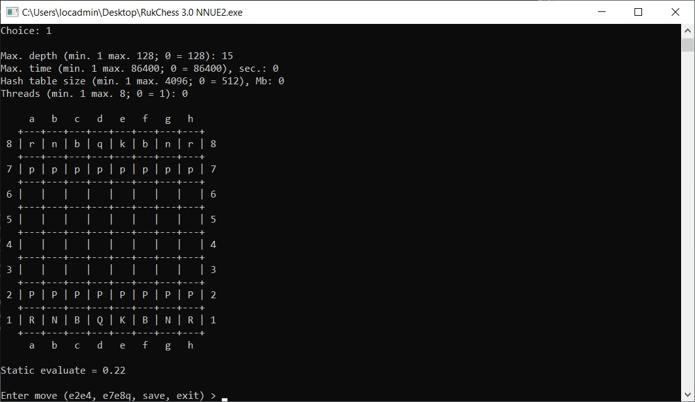
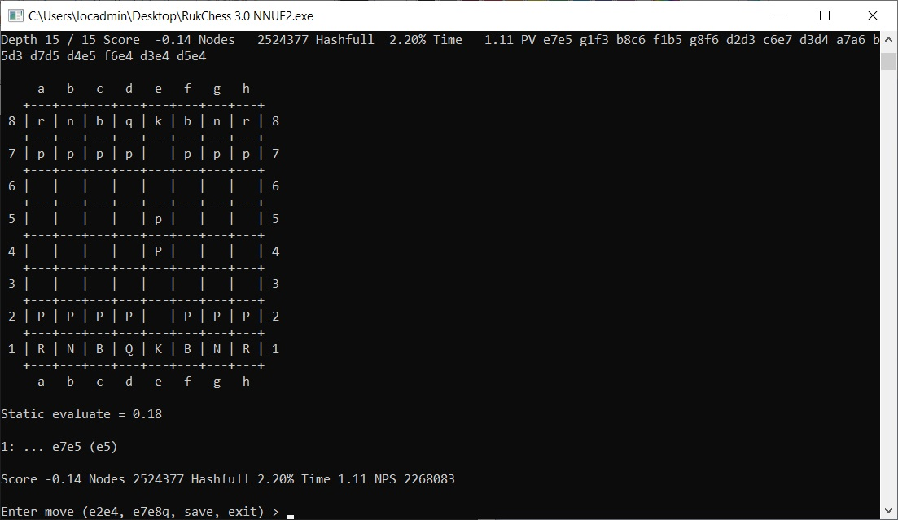
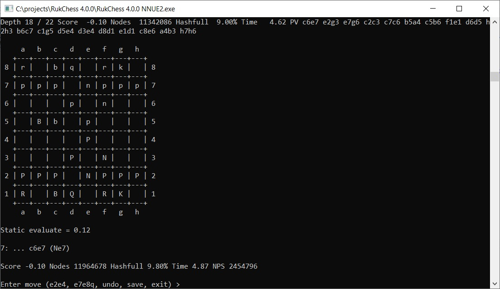

# RukChess
Chess engine with terminal user interface, UCI support and NNUE evaluation function.

# Inspiration
In 1999, I came across the source code of a chess program (now available at https://www.ioccc.org/years.html#1992_vern) and became interested in how a computer could play chess. More than 25 years have passed since then, and many new things have appeared, including NNUE.

# Terminal User Interface (TUI)

# Graphical User Interface (GUI)
1. [Arena Chess GUI](http://www.playwitharena.de/)
2. [Cute Chess](https://cutechess.com/)

# Web User Interface (WebUI)
1. [RukChessWeb](https://github.com/Ilya-Ruk/RukChessWeb)

# Architecture of efficiently updatable neural network (NNUE)
((768 input x 256 hidden) x 2 perspectives) x 1 output

Input layer: 2 colors x 6 pieces x 64 squares = 768  
Hidden layer (ReLU): 256 hidden x 2 perspectives = 512  
Output layer: 1

Net file size: 4 bytes (magic) + 8 bytes (hash) + ((768 x 256) input weights + 256 input biases + (256 x 2) output weights + 1 output bias) x 4 bytes (float) = 789520 bytes

Quantization precision (input): 64  
Quantization precision (output): 512

# [Rating](https://computerchess.org.uk/ccrl/)

## [CCRL Blitz](https://computerchess.org.uk/ccrl/404/) (08.12.2024)

|Version|Net|ELO|
|-------|---|---|
|3.0 NNUE2|[Net 001, Epoch 040, Hash 0x71eb63511cb1](https://github.com/Ilya-Ruk/RukChessNets/blob/master/Nets%20001/rukchess_040.nnue)|3257|
|3.0.15 NNUE2|[Net 070, Epoch 120, Hash 0x755b16a94877](https://github.com/Ilya-Ruk/RukChessNets/blob/master/Nets%20070/rukchess_120.nnue)|3272|
|3.0.17 NNUE2|[Net 110, Epoch 022, Hash 0x6e5001eb7720](https://github.com/Ilya-Ruk/RukChessNets/blob/master/Nets%20110/rukchess_022.nnue)|3271|

## [CCRL 40/15](https://computerchess.org.uk/ccrl/4040/) (16.11.2024)

|Version|Net|ELO|
|-------|---|---|
|3.0 NNUE2|[Net 001, Epoch 040, Hash 0x71eb63511cb1](https://github.com/Ilya-Ruk/RukChessNets/blob/master/Nets%20001/rukchess_040.nnue)|3216|
|3.0.12 NNUE2|[Net 001, Epoch 040, Hash 0x71eb63511cb1](https://github.com/Ilya-Ruk/RukChessNets/blob/master/Nets%20001/rukchess_040.nnue)|3215|
|3.0.15 NNUE2|[Net 070, Epoch 120, Hash 0x755b16a94877](https://github.com/Ilya-Ruk/RukChessNets/blob/master/Nets%20070/rukchess_120.nnue)|3226|
|3.0.15 NNUE2 (4 CPU)|[Net 070, Epoch 120, Hash 0x755b16a94877](https://github.com/Ilya-Ruk/RukChessNets/blob/master/Nets%20070/rukchess_120.nnue)|3305|
|3.0.17 NNUE2|[Net 110, Epoch 022, Hash 0x6e5001eb7720](https://github.com/Ilya-Ruk/RukChessNets/blob/master/Nets%20110/rukchess_022.nnue)|3209|
|3.0.18 NNUE2|[Net 122, Epoch 081, Hash 0x7cf57d4dc994](https://github.com/Ilya-Ruk/RukChessNets/blob/master/Nets%20122/rukchess_081.nnue)|3230|
|3.0.19 NNUE2|[Net 122, Epoch 081, Hash 0x7cf57d4dc994](https://github.com/Ilya-Ruk/RukChessNets/blob/master/Nets%20122/rukchess_081.nnue)|3259|

# Chess programs
1. https://www.ioccc.org/years.html#1992_vern
2. http://www.tckerrigan.com/Chess/TSCP/
3. https://github.com/vancezuo/parallel-chess
4. https://github.com/fogleman/MisterQueen
5. https://github.com/kz04px/Baislicka
6. https://github.com/lucasart/Demolito
7. https://github.com/mAarnos/Hakkapeliitta
8. https://github.com/milostatarevic/xiphos
9. https://github.com/ed-apostol/InvictusChess
10. https://github.com/official-stockfish/Stockfish
11. https://github.com/nodchip/Stockfish
12. https://github.com/syzygy1/Cfish
13. https://github.com/AndyGrant/Ethereal
14. https://github.com/glinscott/Garbochess-JS
15. https://github.com/jhonnold/berserk
16. https://github.com/amanjpro/zahak
17. https://github.com/Aryan1508/Bit-Genie

# Help resources and articles
1. https://www.chessprogramming.org/Main_Page
2. http://wbec-ridderkerk.nl/html/UCIProtocol.html
3. https://en.wikipedia.org/wiki/Algebraic_notation_(chess)
4. https://en.wikipedia.org/wiki/Linear_congruential_generator
5. https://en.wikipedia.org/wiki/Kahan_summation_algorithm
6. https://en.wikipedia.org/wiki/Stochastic_gradient_descent
7. https://ruder.io/optimizing-gradient-descent/
8. https://phoxis.org/2013/05/04/generating-random-numbers-from-normal-distribution-in-c/
9. https://manualzz.com/doc/6937632/toga-log-user-manual
10. https://arxiv.org/abs/1412.6980
11. https://arxiv.org/abs/1509.01549
12. https://arxiv.org/abs/1609.04747
13. https://arxiv.org/abs/1704.08863
14. https://arxiv.org/abs/1711.05101
15. https://arxiv.org/abs/1712.01815
16. https://arxiv.org/abs/1904.09237

# Additional resources
1. https://github.com/zamar/spsa
2. https://github.com/cutechess/cutechess
3. https://github.com/jhonnold/berserk-trainer
4. https://github.com/amanjpro/zahak-trainer
5. https://github.com/Aryan1508/Trainer
6. https://prng.di.unimi.it/splitmix64.c
